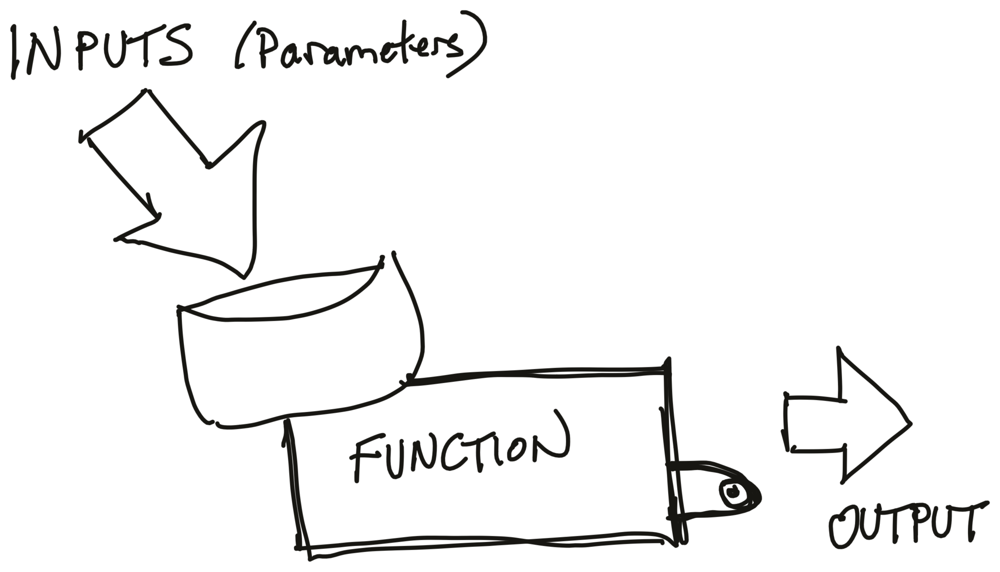

--- 
title: "Designing Monte Carlo Simulations in R"
author: "James E. Pustejovsky and Luke W. Miratrix"
date: "`r Sys.Date()`"
site: bookdown::bookdown_site
documentclass: book
bibliography: [book.bib, packages.bib]
biblio-style: apalike
link-citations: yes
github-repo: jepusto/Designing-Simulations-in-R
description: "A text on designing, implementing, and reporting on Monte Carlo simulation studies"
---

```{r echo = FALSE, messages = FALSE, include=FALSE}
library(tidyverse)
knitr::opts_chunk$set(echo = TRUE, 
                      fig.width = 5,
                      fig.height = 3,
                      out.width = "75%", 
                      fig.align = "center")
options(list(dplyr.summarise.inform = FALSE))
theme_set( theme_classic() )

# automatically create a bib database for R packages

knitr::write_bib(c(
  .packages(), 'bookdown', 'simhelpers', 'knitr', 'rmarkdown', 'purrr'), 'packages.bib')


```


# Introduction


In this text we present an approach for writing Monte Carlo simulations in R.
Monte Carlo simulations are an essential tool of inquiry for quantitative methodologists and students of statistics, useful both for small-scale or informal investigations and for formal methodological research.
Our focus in this text is on the best practices of simulation design and how to use simulation to be a more informed and effective quantitative analyst. 

The primary purpose of this monograph is to provide a guide to designing simulation studies to answer questions about statistical methodology.
The focus is on studies used for formal research purposes (i.e., as might appear in a journal article or dissertation), although many of the programming techniques are relevant to less formal situations as well. 
This guide also covers other uses of simulation, such as for power analysis or even statistical inference.

In general, simulation studies allow for investigating the performance of a statistical model or method under known data-generating processes.
By controlling the data generating process (e.g., by specifying true values for the parameters of a statistical model) and then repeatedly applying a statistical method to data generated by that process, it becomes possible to assess how well a statistical method works.

Overall, we will show how simulation frameworks allow for rapid exploration of the impact of different design choices and data concerns, and how simulation can answer questions that are hard to answer using direct computation (e.g., with power calculators or mathematical formula). 
Simulations are particularly useful for studying models and estimation methods where relevant algebraic formulas are not available, not easily applied, or not sufficiently accurate. 
For example, available algebraic formulas are often based on asymptotic approximations, which might not "kick in" if sample sizes are moderate.
This is, for example, a particular concern with hierarchical data structures that include only 20 to 40 clusters, which is the range of common sample sizes in many large-scale randomized trials in education research. 


## Some of simulation's many uses

As alluded to above, simulation is can be useful across a wide range of areas.
Some are the focus of this text, and others can be more easily tackled with the tools we present.
But to wet the appetite, consider the following areas where one might find need of simulation.

### Comparing statistical approaches

Comparing statistical approaches is perhaps the most common use of Monte Carlo simulation.
In the statistical methodology literature, for example, authors will frequently use simulation to compare their newly proposed method to more traditional approaches to make a case for their method being of real value.
Other simulation-based research will often work to align a literature by systematically comparing a suite of methods all designed to achieve a given task to one another.
In the best case, simulation can show how trade-offs between methods can occur in practice.

For a classic example, Brown and Forsythe (1974) compared four different procedures for conducting a hypothesis test for equality of means in several populations (i.e., one-way ANOVA), but where the population variances are not equal.
Overall, simulation can be critical for understanding the benefits and drawbacks of analytic methods in practice.

Comparitive simulation can also have a practical application: In many situations, more than one modeling approach is possible for addressing the same research question (or estimating the same target parameter).
Comparing the costs of one vs. another using simulation is informative for guiding the design of analytic plans (such as plans included in pre-registered study protocols).
As an example of the type of questions that researchers might encounter in designing analytic plans: what are the benefits and costs of using a model that allows for cross-site impact variation for a multi-site trial in practice?


### Assessing performance of complex pipelines

In practice, statistical methods are often used in combination.
For instance, in a regression model, one could first use a statistical test for heteroskedasticity (e.g., the White test or the Breusch-Pagan test) and then determine whether to use conventional standard errors or HRSE depending on the result of the test. This combination of an initial diagnostic test followed by contingent use of different statistical procedures is all but impossible to analyze mathematically, but it is straight-forward to simulate (see, for example, Long & Ervin, 2000).
In particular, with simulation, we can verify a proposed pipeline is _valid_, meaning that the conclusions it draws are correct at a given level of certainty.

Simulating an analytic pipeline can be used for statistical inference as well.
With bootstrap or parametric bootstrap approaches, for example, one is, in essence, repeatidly simulating data and putting it through an entire analytic pipeline to assess how stable estimation is.
How much a final point estimate varies across the simulation trials is the standard error for the context being simulated; an argument by analogy is what connects this to inference on the original data and point estimate.


### Assessing performance under misspecification

Many statistical estimation procedures can be shown (through mathematical analysis) to perform well when the assumptions they entail are correct.
However, it practice it is often of interest to also understand their robustness---that is, their performance when one or more of the assumptions is incorrect.
For example, how important is the normality assumption underlying multilevel modeling?
What about homoskedasticity?

In a similar vein, when the true data-generating process meets stringent assumptions (e.g., constant treatment effect), what are the potential gain of exploiting such structure in the estimation process?
Conversely, what are the costs of using flexible methods that do not impose the stringent assumption?
A researcher designing an analytic plan would want to be well informed of such tradeoffs in the context they are working in.
Simulation allows for such investigation and comparison.


### Assessing the finite sample performance of a statistical approach

Many statistical estimation procedures can be shown (through mathematical analysis) to work well _asymptotically_---that is, given an infinite amount of data---but their performance in small samples is more difficult to quantify.
Simulation is a tractable approach for assessing the small-sample performance of such methods, or for determining minimum required sample sizes for adequate performance of a method. 
This is perhaps one of the most important uses for simulation: mathematical theory generally is asymptotic in nature, but we are living in the finite world and practice.
In order to know whether the asymptotics "kick in" we must rely on simulation.

For example, heteroskedasticity-robust standard errors (HRSE) are known to work asymptotically, but can be misleading in small samples.
Long and Ervin (2000) use extensive simulations to investigate the properties of different heteroscedasticity robust standard error estimators for linear regression across a range of sample sizes, demonstrating that the most commonly used form of these estimators often does NOT work well with sample sizes typical in the social sciences.
Simulation could answer what asymptotics could not: how these estimators work in typical practice.


For another example, recent work has developed the Fixed-Intercept, Random Coefficient method for estimating and accounting for cross site treatment variation in multisite trials. When there are a moderate number of clusters it appears that the numerical (asymptotic based) estimates of performance are not very accurate. Simulation can unpack these trends and give a more accurate picture of effectiveness in these real contexts.


### Conducting Power Analyses

By repeatidly simulating and then analyzing data from a guessed-at world, a researcher can easily calculate the power to detect the effects so modeled, if that world were true.
This can allow for power analyses far more nuanced and tailored to a given circumstance than typical power calculators.  In particular, simulation can be useful for the following:

 * Available formulas for power analysis in multi-site block- or cluster-randomized trials (such those implemented in the Optimal Design and PowerUp! Software) assume that sites are of equal size and that outcome distributions are unrelated to site size. Small deviations from these assumptions are unlikely to change the results, but in practice, researchers may face situations where sites vary quite widely in size or where site-level outcomes are related to site size.  Simulation can estimate power in this case.
 
 * Available software (such as PowerUp!) allows investigators to make assumptions about anticipated rates of attrition in cluster-randomized trials, under the assumption that attrition is completely at random. However, researchers might anticipate that attrition will be related to baseline characteristics, leading to data that is missing at random but not completely at random. How will this affect the power of a planned study?
 
 * There are some closed-form expressions for power to test mediational relations (i.e., indirect and direct effects) in a variety of different experimental designs, and these formulas are now available in PowerUp!. However, the formulas involve a large number of parameters (including some where it may be difficult in practice to develop credible assumptions) and they apply only to a specific analytic model for the mediating relationships. Researchers planning a study to investigate mediation might therefore find it easier to generate realistic data structures and conduct power analysis via simulation.


### Simulating processess

Less central to this book, but a very common use for simulation, is to simulation some sort of complex process to better understand it or the consequences of it.
For example, some larger school districts (e.g., New York City) have centralized lotteries where families rank some number of schols by order of preference.
The central office then assigns students to schools via a lottery procedure where each student gets a lottery number that breaks ties when there are too many students desiring to go to a specific school.
As a consequence, students have a random probability of assignment to the schools on their list, depending on their choices, the choices of other students, and their lottery numbers.

We can use this process to estimate the causal impact of being assigned to one school vs. another, but only if we have those probabilities of school assignment.
We can obtain them via simulation: we repeatidly run the school lottery over and over, and record where everyone gets assigned.
Using these final propensity scores we can move forward with our analysis.

Another famous area of process simulation are climate models, where researchers simulate the process of climate change.
These physical simulations mimic very complex systems to try and understand how perturbations (e.g., more carbon release) will impact downstream trends.


## The perils of simulation as evidence

As the above argues, simulation has the potential to be a powerful tool for investigating quantitative methods.
Unfortunately, simulation-based argument also opens up a large can of worms, and is very susceptible to critique.
These critiques usually revolve around what the data generating process of the simulations is.
Are the simulated data realistic?
Was the simulation systematic in exploring a wide variety of scenarios, allowing for truly general conclusions?

The best way to answer these arguments is through transparency: explicitly state what was done, and provide code so people can tweak it to run their own simulations.
Another important component of a robust argument is systematic variation: design one simulations so that one can easily simulate across a range of scenarios.
Once that is in place, systematically explore myriad scenarios and report all of the results.

Due to the flexibility in the design of simulations, they are held in great skepticism by many.
A summary of this is the motto

> Simulations are doomed to succeed.


Simulations are alluring: once a simulation framework is set up, it is easy to tweak and adjust.
It is natural for us all to continue to do this until the simulation works "as it should."
This means, if our goal was to show something we "know" is right (e.g., that our new estimation procedure is better than another), we will eventually find a way to align our simulation with our intuition.
This is, simply put, a version of fishing.

To counteract that, challenge yourself to design scenarios where things do not work as you expect.
Try to learn the edges that separate where things work, and where things do not.

   

## Why R and RStudio? 

The statistical software package R runs on both PCs and Macs. The software is free and available online.
R is straightforward to learn, but is sufficiently powerful and versatile to be useful for real projects that you might carry out.
It is used widely for statistical work, and frequently used in research in such fields as education, psychology, economics, medical research, epidemiology, public health, and political science.

We highly recommend using RStudio, which makes using R easier.  RStudio is an Integrated Development Environment (IDE) that structures your experience, helps keep things organized, and offers multiple time-saving features to make your programming experience better. You might also consider using R Markdown. R Markdown allows for generating documents with embedded R code and R output in a clean format, which can greatly help report generation.

Many people seem to believe that R is particularly technically challenging and difficult to master. This probably stems from its extreme flexibility; it is a fully functional programming language as well as a statistical analysis package. R can do things that many other software packages (we're looking at you, Stata) essentially can’t.
But these more involved things are frequently hard to do because they require you to think like a statistical programmer rather than a data analyst.
As a result, R is perceived as a “hard” language to use.
For simulation, in particular, the ability to easily write functions (bundles of commands that you can easily call in different manners), have multiple tables of data in play at the same time, and leverage the vast array of other people's work all make R an attractive option.

Fundamentally, however, we believe even for straightforward, off-the-shelf analyses, R is arguably easier to learn and use in many ways than programs such as Stata or SAS.
This is especially true when R is combined with RStudio for a better programming experience.


### Functions

{ width=50% }


A critical component of simulation design is the use of functions.
A function is a bundle of commands that you can name, so you can use those commands over and over.
You can think of it as a machine, with a hopper that takes some inputs, and a chute that spits out an output based on those inputs.
A function can do anything, and it can even be random in its behavior.
For example, the `rnorm()` function in R takes a number, and gives you that many random, normally distributed, numbers in response.
See [Chapter 19 of R for Data Science](https://r4ds.had.co.nz/functions.html) for an extended discussion, but here is an example function to get you started:

```{r}
one_run <- function( N, mn ) {
  vals = rnorm( N, mean = mn )
  tt = t.test( vals )
  tt$p.value
}
```

The above makes a new command, `one_run()` that takes a sample size $N$ and mean `mn` and generates $N$ normally distributed points centered on `mn`, conducts a $t$-test on the results, and returns the $p$-value for testing whether the mean is zero or not.

We then call our new method as so:
```{r}
one_run( 100, 0.2 )
one_run( 10, 0.3 )
one_run( 10, 0.3 )
```
In this case, each time we run our code, we get a different answer since we are generating random numbers with each call.

We can call it a lot, like so:
```{r pvalue_plot, message=FALSE, warning=FALSE}
set.seed( 30303 )
pvs = replicate( 1000, one_run( 100, 0.2 ) )
qplot( pvs, binwidth=0.02 )
```
We see that if our sample size is 100, and the true mean is 0.2, we often get low $p$-values, but not always.  We can calculate the power of our test as so:
```{r}
mean( pvs <= 0.05 )
```

Via simulation, we have discovered we have about a `r round( 100*mean(pvs<=0.05) )`% chance of rejecting the null, if the alternative is 0.2 and our sample size is 100.

Basically the rest of the book is an elaboration of the ideas above.

### A dangerous function

Functions are awesome, but if you violate their intention, you can get into trouble.
For example, consider the following script you might have:

```{r}

secret_ingredient <- 3

# blah blah blah

funky <- function(input1, input2, input3) {
  
  # do funky stuff
  ratio <- input1 / (input2 + 4)
  funky_output <- input3 * ratio + secret_ingredient
  
  return(funky_output)  
}

funky(3, 2, 5)
```

You then call it like so:

```{r}
secret_ingredient <- 100
funky(3, 2, 5)
```

This is bad: our function acts differently even when we give it the same arguments.
Such behavior can be quite confusing, as we generally expect the function to work a certain way, given the inputs we provided it.

Even worse, we can get errors depending on this extra feature:

```{r, error = TRUE}
secret_ingredient <- "A"
funky(3, 2, 5)
```

This is the #1 gotcha with function writing.
Be careful to, in a function, only use what you are _passed_, as in only use those parameters that are specified at the head of the function.
It is easy to write terrible, confusing code in R.

You can fix it by _isolating the inputs_:

```{r}
secret_ingredient <- 3

# blah blah blah

funky <- function(input1, input2, input3, secret_ingredient) {
  
  # do funky stuff
  ratio <- input1 / (input2 + 4)
  funky_output <- input3 * ratio + secret_ingredient
  
  return(funky_output)  
}

funky(3, 2, 5, 3)
```

Now things are nice:

```{r}
secret_ingredient <- 100
funky(3, 2, 5, 3)

funky(3, 2, 5, 100)
```


### Function skeletons

When we say "skeleton" we simply mean the header of a function, without the middle stuff.  E.g.,

```{r}
run_simulation <- function( N, J, mu, sigma, tau ) {
  
}
```

These are useful for sketching out a general plan of how to organize code.


### `%>%` (Pipe) dreams

We extensively use the "pipe" in our code.
For those unfamiliar, we here spend a moment discussing it, but see R for Data Science, Chapter 18, for more.
The `%>%` command allows you to apply a __sequence of functions__ to a data frame; this makes your code read like a story book.

With conventional code we have

```{r, eval = FALSE}
res1 <- f(my_data, a = 4)
res2 <- g(res1, b = FALSE)
result <- h(res2, c = "hot sauce")
```

Or

```{r, eval = FALSE}
result <- h(g(f(my_data, a = 4), 
              b = FALSE), 
            c = "hot sauce")
```

Ouch.

With the pipe we have

```{r, eval = FALSE}
result <- 
  my_data %>%        # initial dataset
  f(a = 4) %>%       # do f() to it
  g(b = FALSE) %>%   # then do g()
  h(c = "hot sauce") # then do h()
```

Nice!


